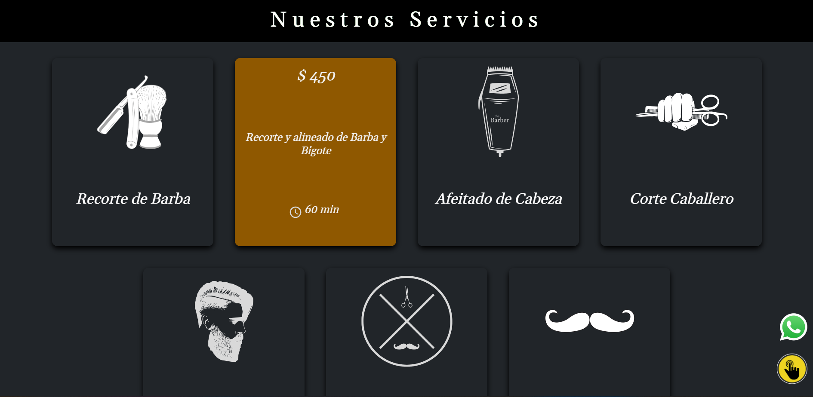
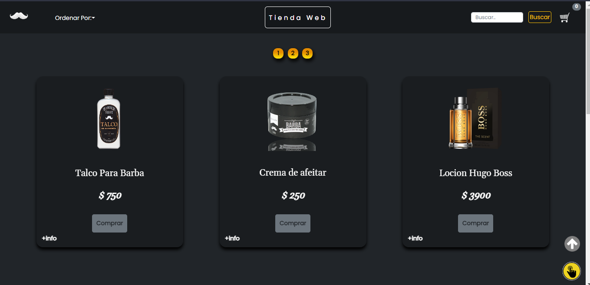
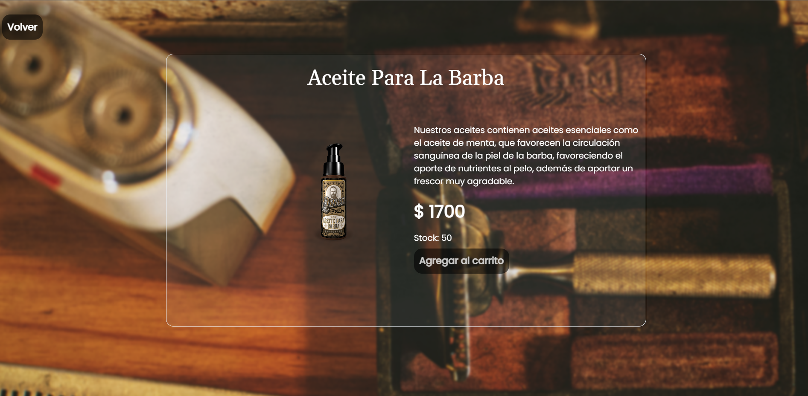
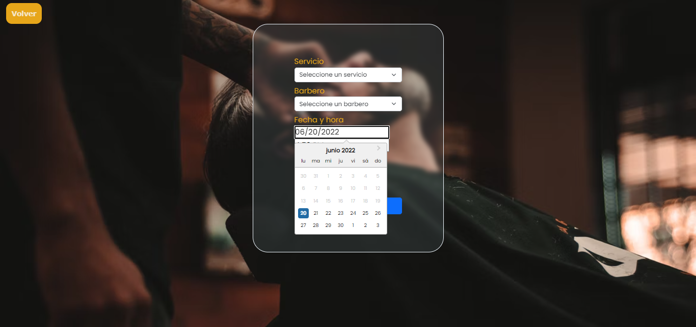
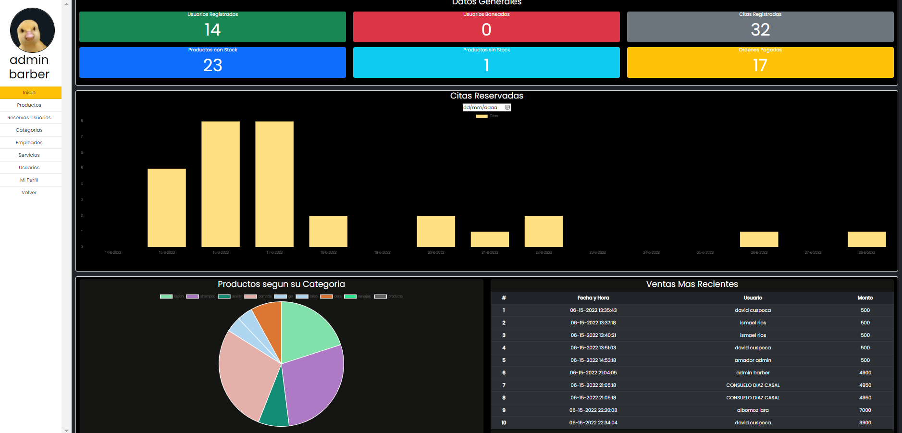
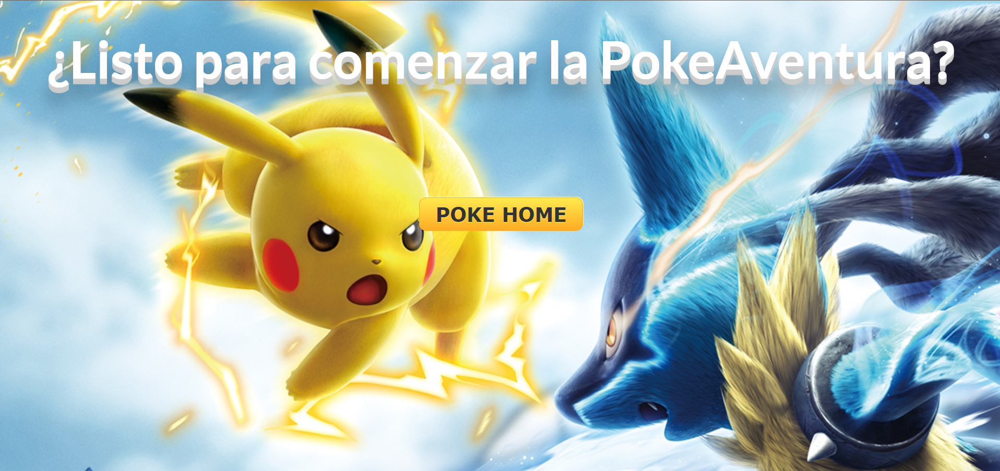
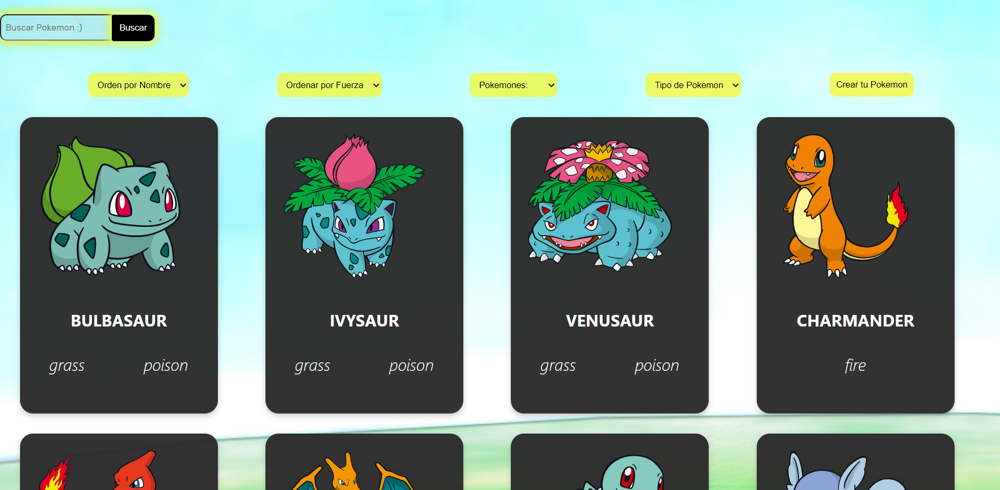
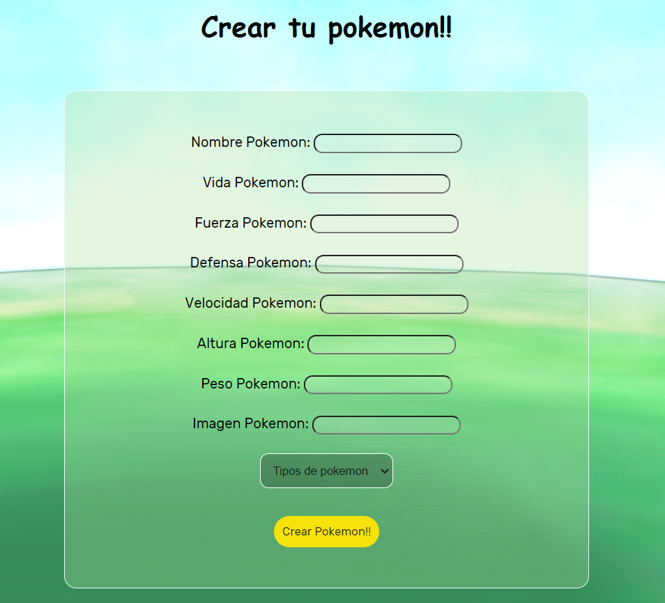
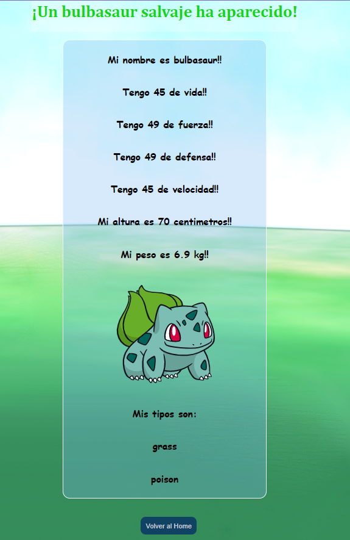
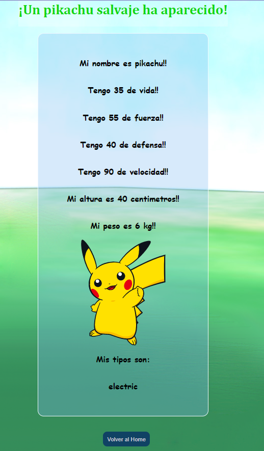

### Hola Mundoo!! 👋

 

<i align="left">Soy Programadora Full-Stack, con orientacion al Front-end⚛️.
  
 Egresada del Bootcamp Soy Henry, donde aprendi a trabajar en equipo, a resolver problemas, y a tener paciencia 😅.
  
 Actualmente sigo profundizando en las tecnologías que ya domino ya que me interesa ofrecer calidad en mi trabajo.
 
Conoci la programacion en el 2021, y fue algo que me apaciono desde el primer momento.
Todo lo que es referido a la tecnologia para mi es algo completamente nuevo, nunca antes pense que me iba a dedicar a esto, pero soy feliz programando, y siempre doy lo mejor de mi✨.
Me gusta trabajar en equipo, porque siento que aprendo muchisimo a la hora de ver como se maneja otro desarrollador.

Aspiro a viajar por el mundo y conocer lugares nuevos. Amo estar rodeada de gente que me hace bien. 
Soy fanatica de la Luna y los atardeceres! 
 </i>

<h2 align="left">Tecnologias:</h2>

<h4>FrontEnd</4>

  

 

 

 
 
<h4>BackEnd & DataBase</h4>

 
 

 
 

<h4>Git</h4>

 
<h2>Mis proyectos:</h2>

<h3>Barber App</h3>
<h5>
Proyecto Final junto a mis compañeros de Bootcamp.
Nuestro proyecto se basa en una barberia en la cual se pueden reservas citas y comprar productos.

El usuario va a tener la opcion de elegir el servicio, al barbero, la fecha y la hora que desee. Una vez creada la cita al usuario le llegara un mail de confirmacion.
Desde su perfil podra ver las citas que tenga pendientes o las que ya hayan finalizado, y podra cancelar una cita si asi lo desea.
La fecha y hora que ya esten reservadas automaticamente apareceran ocupadas para otros usuario.

El usuario tambien podra comprar productos de la barberia, tendra la opcion de agregar los productos a sus favoritos y volver a verlos cuando quiera.
Utilizamos la plataforma de Mercado Pago para una mejor experiencia.
Una vez hecha la compra le llegara un mail de confirmacion.
Y podra ver los productos que haya comprado en su perfil, con toda la informacion detallada.
Desde el lado del administador, se podra agregar, editar, activar/desacrivar segun su stock productos. Tambien podremos agregar y editar servicios. 
Podemos agregar, activar/desactivar empleados. Y activar o bannear usuarios.
Toda la informacion se podra ver desde un Dasboard para tener un panorama mas general del mismo.</h5>

 
<h2>PokeApi</h2>
<h5>En el inicio del proyecto se pueden ver todos los pokemons ordenados en cartas personalizadas. Cada carta va a tener acceso al detalle de cada pokemon, ya sean los pokemons originales o los creados por nosotros.
La api cuenta con un paginado, para poder ver a todos los pokemons de manera ordenada.
 
Se puede:
- Buscar al pokemon por su nombre atraves del buscador.
- Ordenar ascendentemente y descendentemente por orden alfabético.
- Ordenar ascendentemente y descendentemente por fuerza.
- Filtrar por tipo de pokemon.
- Filtrar por pokemons originales o los creados por el usuario.
- Tenemos la posibilidad de crear pokemons con los datos de nuestra preferencia. El formulario cuenta con sus respectivas validaciones.
</h5>

